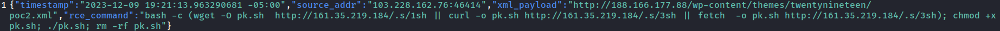
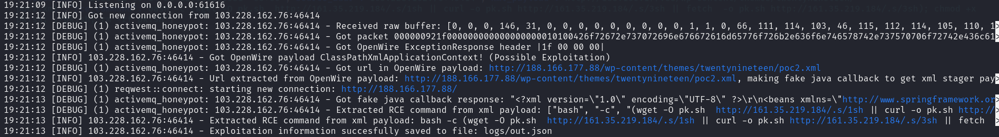

# activemq-honeypot
Honeypot that scopes CVE-2023-46604 vulnerability and focused on getting Indicators of Compromise. This honeypot can be used in any Threat intelligence infrastructure to get attacker's IP adresses, Post-Exploration samples and malware samples. This information can be helpful to detect and prevent attacks in future.

